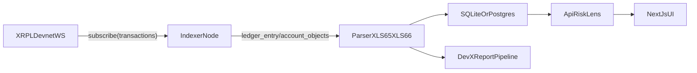

# Plan hackathon RiskLens (XLS-65 / XLS-66)

## 1) Contexte et double livrable

Objectif hackathon: livrer une application utile (RiskLens) **et** un retour d'experience technique exploitable par Ripple sur les zones grises de XLS-65/XLS-66.

Deux livrables obligatoires pour la demo:

- [ ] **Prototype RiskLens**: dashboard de risque (macro, leaderboard, fiche courtier, simulateur de pertes).
- [ ] **Rapport DevX**: fichier racine `FEEDBACK_XLS65_XLS66.md` avec retours structures sur libs, docs, UX dev et primitives manquantes.

References specs:
- [XLS-65](./xls-65-full_doc.md)
- [XLS-66](./xls-66_full_doc.md)

---

## 2) Proposition de valeur et angle de pitch

**Probleme**: un deposant ne dispose pas d'outil natif XRPL pour evaluer le risque reel d'un Loan Broker (qualite de credit, couverture first-loss, concentration).

**Solution RiskLens**: un tableau de bord de notation on-chain qui transforme les objets protocolaires en signaux actionnables:

- [ ] Score courtier (AAA -> D) avec methodologie transparente.
- [ ] Surveillance continue des evenements de risque (`LoanManage`, `LoanPay`, `LoanDelete`, `VaultWithdraw`).
- [ ] Simulateur "what-if" de pertes et impact deposants.

**Message jury**: "Nous n'avons pas juste affiche des donnees XRPL: nous avons teste les limites reelles de l'ecosysteme XLS-65/66 et remonte des feedbacks actionnables."

---

## 3) Glossaire protocole (verites de spec a respecter)

### Objets ledger

- [ ] `Vault` (XLS-65): `AssetsTotal`, `AssetsAvailable`, `LossUnrealized`, `ShareMPTID`, `Scale`, `Flags`.
- [ ] `LoanBroker` (XLS-66): `DebtTotal`, `DebtMaximum`, `CoverAvailable`, `CoverRateMinimum`, `CoverRateLiquidation`, `ManagementFeeRate`, `OwnerCount`, `VaultID`, `Account` (pseudo-compte).
- [ ] `Loan` (XLS-66): `PrincipalOutstanding`, `TotalValueOutstanding`, `ManagementFeeOutstanding`, `PaymentRemaining`, `NextPaymentDueDate`, `GracePeriod`, flags `lsfLoanImpaired` / `lsfLoanDefault`.

### Transactions a monitorer

- [ ] Vault: `VaultCreate`, `VaultSet`, `VaultDeposit`, `VaultWithdraw`.
- [ ] Lending: `LoanBrokerSet`, `LoanBrokerCoverDeposit`, `LoanBrokerCoverWithdraw`, `LoanSet`, `LoanPay`, `LoanManage`, `LoanDelete`.

### Corrections importantes vs raccourcis frequents

- [ ] Pas de tx `LoanImpair` / `LoanDefault` separees: c'est `LoanManage` avec `tfLoanImpair` / `tfLoanDefault`.
- [ ] Les taux sont en **1/10 bps** (1 = 0.001%): toujours convertir pour l'affichage et les calculs metier.
- [ ] `Loan` peut etre supprime (`LoanDelete`) quand solde/default: l'historique ne peut pas dependre uniquement de l'etat courant.

---

## 4) Algorithme de Risk Score (AAA -> D)

### Metriques et poids

- [ ] **FLCR (35%)**: `CoverAvailable / max(DebtTotal, epsilon)`.
- [ ] **NPL (25%)**: `LoansImpairedOrDefaulted / LoansIssued`.
- [ ] **Concentration (20%)**: `LargestActiveLoan / max(DebtTotal, epsilon)`.
- [ ] **Liquidite residuelle (10%)**: `AssetsAvailable / max(AssetsTotal, epsilon)`.
- [ ] **Identite verifiee DID (10%)**: score binaire ou graduel selon preuves rattachees.

### Normalisation et score final

- [ ] Normaliser chaque metrique en sous-score `[0..100]` (plus haut = meilleur).
- [ ] Score final:
  - `riskScore = 0.35*flcr + 0.25*npl + 0.20*concentration + 0.10*liquidity + 0.10*did`
- [ ] Mapping note:
  - `AAA >= 85`
  - `AA >= 75`
  - `A >= 65`
  - `BBB >= 55`
  - `BB >= 45`
  - `B >= 35`
  - `CCC >= 25`
  - `CC >= 15`
  - `C >= 5`
  - `D < 5`

### Formules protocolaires a implementer explicitement

- [ ] **XLS-65 (double taux de change)**:
  - Depot (hors premier depot): `DeltaShares = (DeltaAssets * GammaShares) / GammaAssets` (arrondi inferieur).
  - Redeem: `DeltaAssets = (DeltaShares * (GammaAssets - iota)) / GammaShares`.
  - Withdraw: conversion asset->shares avec `(GammaAssets - iota)` puis retour assets.
  - Exception withdraw: si le withdrawer est seul detenteur de shares, ne pas deduire `LossUnrealized`.
- [ ] **XLS-66 (default coverage)**:
  - `coverRateMinimumPct = LoanBroker.CoverRateMinimum / 100000`
  - `coverRateLiquidationPct = LoanBroker.CoverRateLiquidation / 100000`
  - `DefaultAmount = Loan.TotalValueOutstanding - Loan.ManagementFeeOutstanding`
  - `MinimumCover = LoanBroker.DebtTotal * coverRateMinimumPct`
  - `DefaultCovered = min(MinimumCover * coverRateLiquidationPct, DefaultAmount, LoanBroker.CoverAvailable)`
  - `VaultLoss = DefaultAmount - DefaultCovered`

---

## 5) Architecture technique



### Composants

- [ ] **Indexer Node.js**: abonnement WS `transactions`, parsing meta, persistence.
- [ ] **Fallback data access**: si `vault_list` indisponible (Clio-only), utiliser `account_objects` + `ledger_entry` cible.
- [ ] **API read model**: endpoints "market overview", "broker leaderboard", "broker details", "stress simulation".
- [ ] **Frontend**: Next.js + Tailwind + composants type shadcn/ui + graphiques (Recharts/Chart.js).

### Evenements a persister (minimum)

- [ ] `VaultDeposit`, `VaultWithdraw`
- [ ] `LoanSet`, `LoanPay`, `LoanManage`, `LoanDelete`
- [ ] `LoanBrokerCoverDeposit`, `LoanBrokerCoverWithdraw`, `LoanBrokerCoverClawback`

---

## 6) Roadmap chronologique (J-7 -> H48 -> Demo)

## Preparation (J-7 a J-1)

- [ ] J-7/J-6: valider stack, creer schema DB, definir event model.
- [ ] J-5: script seeding v1 (comptes, token, vault, brokers, loans).
- [ ] J-4: indexeur + parser transaction metadata.
- [ ] J-3: endpoints API + premier calcul score.
- [ ] J-2: UI skeleton (macro + leaderboard + detail broker).
- [ ] J-1: dry-run complet + rapport DevX pre-rempli + script demo minute par minute.

## Execution hackathon (H0-H48)

- [ ] **H0-H4**: bootstrap repo/projet, connexions Devnet, variables env.
- [ ] **H4-H10**: seeding scenarios (3 brokers), verification et snapshots baseline.
- [ ] **H10-H16**: indexeur robuste + reconstruction historique prete.
- [ ] **H16-H22**: moteur score + tests de cohérence numerique.
- [ ] **H22-H30**: UI macro + leaderboard + filtres.
- [ ] **H30-H36**: page detail courtier + timeline events + flags risque.
- [ ] **H36-H42**: simulateur de pertes (slider + projection deposants).
- [ ] **H42-H46**: rapport DevX finalise (issues, impact, suggestion, evidence).
- [ ] **H46-H48**: rehearsal pitch, captures ecran, demo script final.

## Demo day

- [ ] Onglet A: prototype live avec 1 broker sain + 1 broker en crise.
- [ ] Onglet B: `FEEDBACK_XLS65_XLS66.md` resume en 1 slide.

---

## 7) Script de seeding (obligatoire)

## Objectif
Generer des donnees demonstrables pour eviter un dashboard vide.

## Scenarios brokers

- [ ] **Broker A - Bon eleve**: forte couverture, paiements reguliers, aucun default.
- [ ] **Broker B - Speculatif**: couverture proche du minimum, concentration elevee.
- [ ] **Broker C - Defaillant**: impairment puis default pour activer first-loss.

## Sequence transactionnelle type

- [ ] Initialisation:
  - creer asset test (IOU ou MPT selon scenario),
  - `VaultCreate`,
  - `LoanBrokerSet` avec `CoverRateMinimum`/`CoverRateLiquidation`,
  - `VaultDeposit`,
  - `LoanBrokerCoverDeposit`.
- [ ] Emission des prets:
  - `LoanSet` (double signature),
  - stocker tx blobs/signatures et metadonnees.
- [ ] Cas sain:
  - `LoanPay` periodiques jusqu'a quasi solde.
- [ ] Cas crise acceleree:
  - `LoanManage(tfLoanImpair)` pour marquer une perte potentielle,
  - attendre > `GracePeriod`,
  - `LoanManage(tfLoanDefault)` pour declencher liquidation cover.

## Timing exact pour defaut rapide (compatible contraintes spec)

- [ ] Regler `PaymentInterval = 120s`, `GracePeriod = 60s` (respect min 60s).
- [ ] Apres `LoanSet`, lancer `tfLoanImpair` des que possible.
- [ ] Verifier via lecture on-chain que `NextPaymentDueDate` est bien au temps courant (ou inferieur) apres impairment.
- [ ] Attendre `65-75s` (strictement > `GracePeriod` apres `NextPaymentDueDate` repositionnee).
- [ ] Lancer `tfLoanDefault` (sinon `tecTOO_SOON`).

## Runbook seeding (ordre conseille)

- [ ] **T+00m -> T+05m**: financer wallets (issuer, 3 brokers, 3 borrowers, 2 depositors) et creer trustlines.
- [ ] **T+05m -> T+08m**: creer 3 vaults (`VaultCreate`) puis 3 brokers (`LoanBrokerSet`).
- [ ] **T+08m -> T+12m**: deposer liquidite (`VaultDeposit`) + couvrir first-loss (`LoanBrokerCoverDeposit`).
- [ ] **T+12m -> T+18m**: emettre 1-3 prets par broker (`LoanSet` co-signe).
- [ ] **T+18m -> T+24m**:
  - Broker A: `LoanPay` normal,
  - Broker B: paiement partiel/retard (sans default),
  - Broker C: `LoanManage(tfLoanImpair)` puis attente > `GracePeriod` puis `LoanManage(tfLoanDefault)`.
- [ ] **T+24m -> T+30m**: verifier et stocker snapshots (`vault_info`, `ledger_entry`, balances pseudo-comptes), puis peupler le cache local pour la demo.

---

## 8) UI/UX a livrer

## Vue macro

- [ ] TVL total protocol lending.
- [ ] Dette active totale.
- [ ] Taux de defaut reseau.

## Leaderboard coffres/courtiers

- [ ] Colonnes: asset, APY estime, TVL, DebtTotal, FLCR, note risque.
- [ ] Filtres: asset, intervalle de score, statut (actif/impaired/default recent).
- [ ] Badges visuels: vert (sur-couvert), orange (proche seuil), rouge (sous seuil).

## Fiche detail courtier + killer feature

- [ ] Timeline des evenements (`LoanSet`, `LoanPay`, `LoanManage`, `LoanDelete`).
- [ ] Courbe d'evolution `CoverAvailable / DebtTotal`.
- [ ] Simulateur slider "x% des emprunteurs font defaut" avec:
  - pertes absorbees par first-loss,
  - pertes residuelles deposants,
  - impact attendu sur note.
- [ ] Bloc technique "Deposit Rate vs Withdrawal Rate" quand `LossUnrealized > 0`.

---

## 9) Developer Experience Report (process + structure)

Creer et maintenir `FEEDBACK_XLS65_XLS66.md` pendant le dev (pas a la fin uniquement).

## Template d'entree de friction

- [ ] `Contexte` (action, tx, endpoint, env).
- [ ] `Issue` (bug, manque, ambiguite).
- [ ] `Impact` (temps perdu, risque erreur, dette code).
- [ ] `Evidence` (hash tx, payload, erreur `tec/tem/ter`, logs, capture).
- [ ] `Suggestion` (API helper, type, doc step, exemple minimal).

## Structure finale recommandee

- [ ] `1. Client Library Gaps (xrpl.js)`
- [ ] `2. Missing Primitives & Ledger Mechanics`
- [ ] `3. UX / Developer Friction`
- [ ] `4. Documentation & Tutorials`

## Axes de validation concrets pendant implementation

- [ ] Qualite des types `Vault`/`Loan`/`LoanBroker` dans xrpl.js.
- [ ] Presence/absence de helpers pour conversions shares/assets et taux.
- [ ] Friction de co-signature `LoanSet` (ordre, ergonomie, erreurs).
- [ ] Limitations de subscription WS (filtrage par vault/broker).
- [ ] Clarte des erreurs `rippled` et guidance docs en scenario de crise.

---

## 10) Risques, plans B, et checklist critique

## Risques techniques

- [ ] Devnet instable ou indisponible.
- [ ] Donnees faibles/absentes pendant la demo.
- [ ] Differences entre spec draft et implementation effective.
- [ ] Endpoint `vault_list` non disponible selon noeud.

## Plans B

- [ ] Cache local DB + mode "replay" depuis fixtures JSON.
- [ ] Export snapshots post-seeding pour demo offline partielle.
- [ ] Fallback RPC (`account_objects`, `ledger_entry`, tx history stockee).
- [ ] Toggle "Demo dataset" si websocket coupe.

## Checklist J-1 (go/no-go)

- [ ] Script seeding execute en < 10 min sans erreur bloquante.
- [ ] Au moins 1 default + 1 impair visibles dans UI.
- [ ] Notes AAA->D coherentes avec scenarios.
- [ ] Simulateur aligne sur formule `DefaultCovered`.
- [ ] Rapport DevX complete avec evidences reproduisibles.

---

## 11) Stack cible et arborescence projet

## Stack

- [ ] Frontend: Next.js + Tailwind + composants UI.
- [ ] Backend/API: Node.js (Fastify ou Express).
- [ ] Ingestion: xrpl.js (>= 4.6.0) + WS streaming.
- [ ] Donnees: SQLite local (hackathon) avec possibilite Postgres.
- [ ] Graphiques: Recharts ou Chart.js.

## Arborescence recommandee

```text
ripple/
  PLAN_RISKLENS.md
  FEEDBACK_XLS65_XLS66.md
  README.md
  apps/
    web/
  services/
    indexer/
    api/
  packages/
    risk-engine/
    shared-types/
  scripts/
    seed-devnet.ts
    demo-scenario.ts
  data/
    fixtures/
    snapshots/
```

## Definition of done globale

- [ ] Prototype demonstrable de bout en bout.
- [ ] Feedback DevX factuel, structure, et priorise.
- [ ] Narratif pitch: probleme -> preuve on-chain -> simulateur -> recommandations Ripple.
